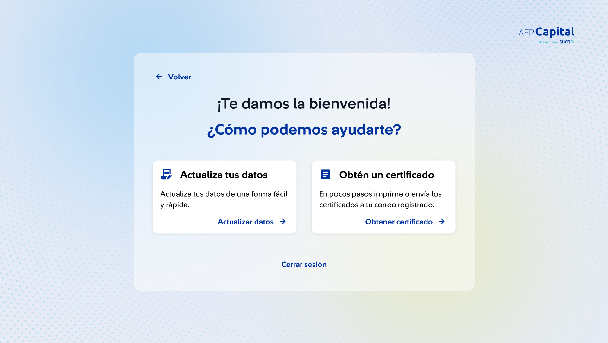
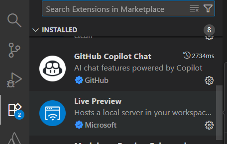
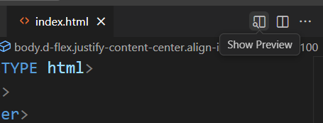

# Reto de responsive design

## Objetivos: Implementar la siguiente vista con capacidades responsivas

Figma: [ir al figma](https://www.figma.com/design/OUsjaZqabvpyJAFfsktA4i/Handoff-Avatar-F02?node-id=1483-5274&t=uzAl1MOItMhQ3Y2O-0)

Los recursos necesarios para implementar esta vista ya se encuentran en el proyecto.

Recomendación, instalar esta extensión: 

y al abrir el index.html activar el live preview:

